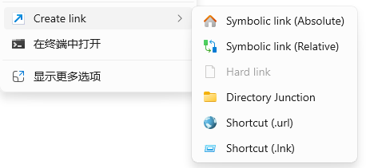
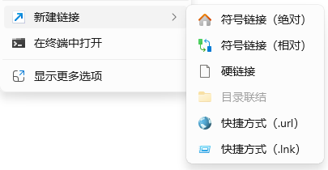

# Context Menu mklink

Create symbolic link, hard link (and more!) in context menu. Windows 11 context menu supported.

Fully i18n support! (Now support Simplified Chinese)

This software is still in the early development stage.

## Install

1. Enable [Developer Mode](https://learn.microsoft.com/en-us/windows/apps/get-started/developer-mode-features-and-debugging) in Windows Settings
2. Download the latest .7z from [Releases](https://github.com/qwertycxz/ContextMenu-mklink/releases)
3. Extract the .7z file to a folder of your choice
4. Start PowerShell and navigate to the extracted folder
5. Run `Add-AppxPackage AppxManifest.xml -Register`
6. If the context menu item isn't showing up, try restarting Windows Explorer.

To uninstall, please head to Windows Settings.

## Usage

1. Copy any files or folders in explorer.
2. Right-click in the directory background. You can see a *Create Link* menu.
3. Choose the link type you want to create. And here you go! A link is successfully created!

## Contributor

[@qwertycxz](https://github.com/qwertycxz)

## How could I contribute?

[Issue](https://github.com/qwertycxz/ContextMenu-mklink/issues) and [Pull-requests](https://github.com/qwertycxz/ContextMenu-mklink/pulls) are both welcomed.

## License

[Apache 2.0](LICENSE) © qwertycxz
